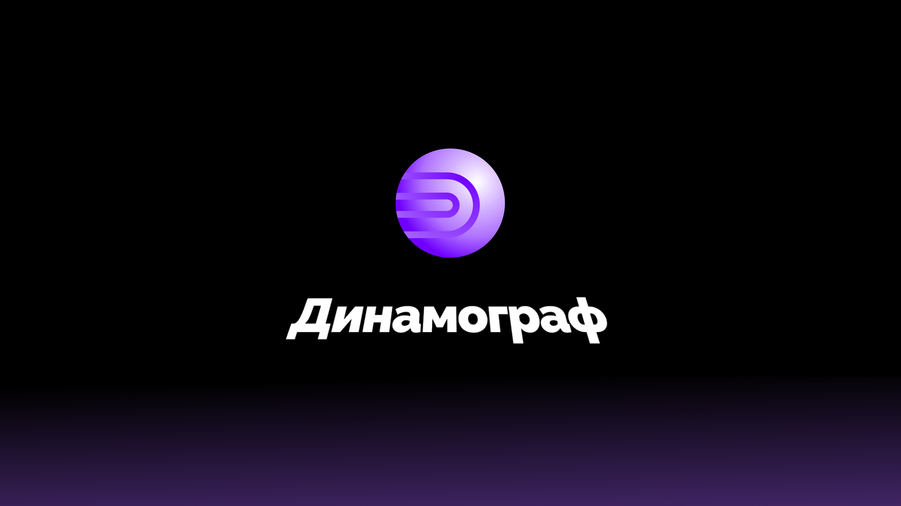

# Динамограф
Клиентское приложение для обслуживания [**Динамограф AI**](https://github.com/YaraZan/dinamograph-api).
Упрощает процесс манипуляций с датасетами, маркерами, а также состоянием и настройками моделей машинного обучения.

## Функционал

- [x] **Создание новых моделей:**

  Создание модели, обучение на текущих датасетах с возможностью настройки (например, `эпохи`).

- [x] **Тестирование**

  Новые, а также созданные ранее модели, могут быть сразу же протестированы.

- [x] **Создание новых маркеров**

  Возможность пополнять список маркеров для совершенствования модели

- [x] **Персонализация**

  Возможность менять цветовую тему приложения 🌙

## Стек технологий
**Client:** Vue, Vite, TailwindCSS

**Server:** Laravel

**Database:** PostgreSQL

## Производство

Проект нашёл своё применение в компании [ПАО "Татнефть"](https://www.tatneft.ru/)

